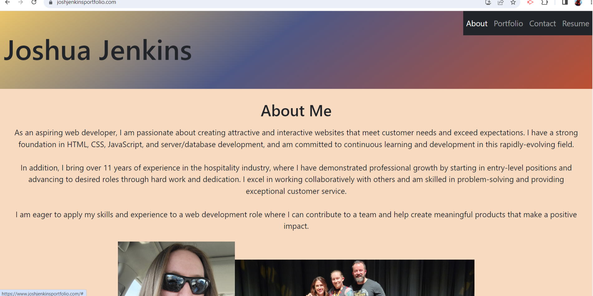

# Joshua Jenkins React Portfolio

 

## Description

Our challange this week was to recreate our professional portfolio using React.js. The portfolio needed to have a navigation bar that would change the main body of the page with it being a single-page website and a header and footer that consist across each page. I was excited to rebuild my portfolio, as I've been wanting to update my original anyway, and I've been working on building my resume recently as well. I learned a lot about React.js this past week, and got plenty of valuable experience working with it while building this portfolio, as well as getting some more experience creating my own styling, which I haven't done in a while. I used inline css as well as external css and bootstrap for my styling. I tryied to avoid using any external css just to say I'd done so, but external styling was the easiest way to add media queries.  
  
## Table of Contents
  
[Installation](#Installation)
  
[Usage](#Usage)

[License](#License)

## Installation

The site is deployed at my own domain [here](https://joshjenkinsportfolio.com).

## Usage

When you navigate to the website, you will be presented with my About Me page. At the top right will be the navigation bar, which will be collapsed if you are on a smaller screen. The links in the navigation can direct you to my About Me page, my Projects page, my Contact page, and my Resume page. If you use the contact form, an error message will appear if you fail to fill a field or give an invalid email address. On the Resume page, there is a link you can click to download a pdf of my resume.

## License

Licensed under the [MIT License](https://opensource.org/licenses/MIT)

## Questions

Contact me with any questions:
[Email](#)